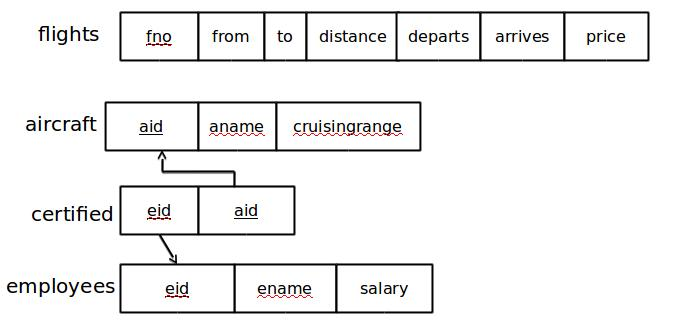

# Problem 5

Consider the following database for a banking enterprise:

* Branch (***branch-name***: string, branch-city: string, assets: real)
* Account (***accno***: int, branch-name: string, balance: real)
* Depositor (***customer-name***: string, ***accno***: int)
* Customer (***customer-name***: string, customer-street: string, customer-city: string)
* Loan (***loan-number***: int, branch-name: string, amount: real)
* Borrower (***customer-name***: string, ***loan-number***: int)


## 1. Create the above tables by properly specifying the primary and foreign keys

```sql
CREATE TABLE Branch (
    br_name  varchar2(20)   PRIMARY KEY,
    br_city  varchar2(20),
    assets   number(10, 2)
);
```

```sql
CREATE TABLE Account (
    acc_no    number(10)     PRIMARY KEY,
    br_name   varchar2(20)   REFERENCES Branch,
    bal       number(10, 2)
);
```

```sql
CREATE TABLE Customer (
    cust_name    varchar2(20)   PRIMARY KEY,
    cust_street  varchar2(20),
    cust_city    varchar2(20)
);
```

```sql
CREATE TABLE Depositor (
    cust_name  varchar2(20)   REFERENCES Customer ON DELETE CASCADE,
    acc_no     number(10)     REFERENCES Account ON DELETE CASCADE,

    PRIMARY KEY(cust_name, acc_no)
);
```

*Note:* If `ON DELETE CASCADE` option is set, a delete operation in the master table will trigger a delete operation for corresponding records in all foreign tables.

```sql
CREATE TABLE Loan (
    loan_no   number(10)     PRIMARY KEY,
    br_name   varchar2(20)   REFERENCES Branch ON DELETE CASCADE
    amt       number(10, 2)
);
```

```sql
CREATE TABLE Borrower (
    cust_name   varchar2(20)   REFERENCES Customer ON DELETE CASCADE,
    loan_no     number(10)     REFERENCES Loan ON DELETE CASCADE,

    PRIMARY KEY(cust_name, loan_no)
);
```

## 2. Find all the customers who have at least two accounts at the main branch.

```sql
SELECT DISTINCT Depositor.cust_name

FROM   Depositor,
       Account

WHERE  Depositor.acc_no = Account.acc_no AND
       Account.br_name = 'Main'

GROUP BY Depositor.cust_name

HAVING COUNT(Depositor.acc_no) >= 2;  
```

## 3. Find all the customers who have an account at *all* the branches located in a specific city.

```sql
SELECT Customer.cust_name

FROM   Customer

WHERE  NOT EXISTS (

    (SELECT br_name
     FROM   Branch
     WHERE  br_city = 'Bangalore')

    MINUS

    (SELECT Account.br_name
     FROM   Depositor, Account
     WHERE  Depositor.acc_no = Account.acc_no AND
            Depositor.cust_name = Customer.cust_name)

);  
```

## 4. Demonstate how to delete all account tuples at every branch in a specific city.

```sql
DELETE FROM Account

WHERE  br_name IN (
    SELECT br_name
    FROM   branch
    WHERE  br_city = 'Bangalore'
);  
```

# Problem 4

The following tables are maintained by a book dealer:

* Author (***author-id***: int, name: string, city: string, country: string)
* Publisher (***publisher-id***: int, name: string, city: string)
* Category (***category-id***: int, description: string)
* Catalog (***book-id***: int, title: string, author-id: int, publisher-id: int, category-id: int, year: int, price: int)
* Order\_Details (***order-no***: int, book-id: int, quantity: int)


## 1. Create the above tables by properly specifying the primary and foreign keys

```sql
CREATE TABLE Author (
    author_id   number(6)        PRIMARY KEY,
    name        varchar2(20),
    city        varchar2(20),
    country     varchar2(20)
);
```

```sql
CREATE TABLE Publisher (
    publisher_id   number(6)     PRIMARY KEY,
    name           varchar2(30),
    city           varchar2(20),
    country        varchar2(20)
);
```

```sql
CREATE TABLE Category (
    category_id   number(6)      PRIMARY KEY,
    description   varchar2(20)
);
```

```sql
CREATE TABLE Catalog (
    book_id        number(6)     PRIMARY KEY,
    title          varchar2(20),
    author_id      number(6)     REFERENCES Author
    publisher_id   number(6)     REFERENCES Publisher
    category_id    number(6)     REFERENCES Category
    year           number(4),
    prince         number(7, 2)
);
```

```sql
CREATE TABLE Order_Details (
    order_no   number(6)         PRIMARY KEY,
    book_id    number(6)         REFERENCES Catalog,
    qty        number(6)
);
```

## 2. Find the authors who have 2 or more books in the catalog, where the price of the books is greater than the average price of the books in the catalog, and the year of publication is after 2000

```sql
SELECT *

FROM   Author

WHERE  author_id IN (

    SELECT author_id
    FROM   Catalog
    WHERE  price > (

        SELECT AVG(price)
        FROM   Catalog

    )

    AND year > 2000

    GROUP BY author_id

    HAVING Count(*) >= 2
);  
```

## 3. Find the author of the book with the most sales

```sql
SELECT author_id,
       name

FROM   Author,
       Catalog

WHERE  Author.author_id = Catalog.author_id AND
       Catalog.book_id IN (

           SELECT book_id
           FROM   Order_Details
           GROUP BY book_id
           HAVING SUM(qty) = (

               SELECT MAX(SUM(quantity))
               FROM   Order_Details
               GROUP BY book_id

           )

);  
```

## 4. Demonstrate how to increase the price of a specific publisher's books by 10%

```sql
UPDATE Catalog

SET    price = ( price * 1.1 )

WHERE  publisher_id IN (

    SELECT publisher_id
    FROM   Publisher
    WHERE  name = 'eee'
    
);  
```

# Problem 3

Consider the following database of student enrollment in courses and books adopted for each course

* Student (***regno***: string, name: string, major: string, bdate: date),
* Course (***courseno***: int, cname: string, dept: string)
* Enroll (***regno***: string, ***courseno***: int, sem: int, marks: int)
* Text (***book-isbn***: int, book-title: string, publisher: string, author: string)
* Book_Adoption (***courseno***: int, ***sem***: int, book-isbn: int)


## 1. Create the above tables by properly specifying the primary and foreign keys

```sql
CREATE TABLE Student (
    regno   varchar2(10)   PRIMARY KEY,
    name    varchar2(20),
    major   varchar2(20),
    bdate   date
);
```

```sql
CREATE TABLE Course (
    courseno   number(6)      PRIMARY KEY,
    cname      varchar2(10),
    dept       varchar2(5)
);
```

```sql
CREATE TABLE Enroll (
    regno      varchar2(10)   REFERENCES Student,
    courseno   number(6)      REFERENCES Course,
    sem        number(2),
    marks      number(5),
    
    PRIMARY KEY(regno, courseno)
);
```

```sql
CREATE TABLE Text (
    book_isbn    number(10)     PRIMARY KEY,
    book_title   varchar2(20),
    publisher    varchar2(20),
    author       varchar2(20)
);
```

```sql
CREATE TABLE Book_Adoption (
    courseno    number(6)    REFERENCES Course,
    sem         number(2),
    book_isbn   number(10)   REFERENCES Text,
    
    PRIMARY KEY(courseno, sem)
);
```

## 2. Demonstrate how you add a new text book to the database and make this book be adopted by some department

```sql
INSERT INTO Text
VALUES (
    1007,
    'FAFL',
    'Pearson',
    'Ulman'
);
```

```sql
INSERT INTO Book_Adoption
VALUES (
    002,
    4,
    1007
);
```

## 3. Produce a list of text books in alphabetic order for the courses used by the CS department, that use more than two books.

```sql
SELECT Book_Adoption.courseno, Text.book_isbn, Text.book_title

FROM   Text, Book_Adoption, Course

WHERE  Text.book_isbn = Book_Adoption.book_isbn AND
       Book_Adoption.courseno = Course.courseno AND
       Course.dept=’CSE’ AND
       Book_Adoption.courseno IN (

           SELECT courseno
 		   FROM Book_Adoption
 		   GROUP BY courseno
 		   HAVING COUNT(*)>2

       )

ORDER BY Text.book_title;
```

## 4. List any department that has *all* its adopted books published by a specific publisher.

```sql
SELECT DISTINCT dept

FROM   Course

WHERE  courseno IN (

     SELECT courseno
     FROM   Book_Adoption
     WHERE  book_isbn IN (

         SELECT book_isbn
         FROM   Text
         WHERE  publisher = 'TMH'
         
     )

);
```

# Problem 2

The following relations keep track of airline flight information:

* Flights (no: integer, from: string, to: string, distance: integer, departs: time, arrives: time, price: real)
* Aircraft (aid: integer, aname: string, cruisingrange: integer)
* Certified (eid: integer, aid: integer)
* Employee (eid: integer, ename: string, salary: integer)

Note that the Employees relation describes pilots as well as other kinds of employees. Every pilot is certified for at least one aircraft, and only pilots are certified to fly.



## 1. Create the above tables by properly specifying the primary and foreign keys.

```sql
CREATE TABLE Flights (
    fno        number(5)      PRIMARY KEY,
    frm        varchar2(10),
    to         varchar2(10),
    distance   number(10),
    departs    varchar2(10),
    arrives    varchar2(10),
    price      number(10, 2)
);
```

```sql
CREATE TABLE Aircraft (
    aid             number(5)      PRIMARY KEY,
    aname           varchar2(20),
    cruisingrange   number(10)
);
```

```sql
CREATE TABLE Employee (
    eid      number(5)      PRIMARY KEY,
    ename    varchar2(20),
    salary   number(6)
);
```

```sql
CREATE TABLE Certified (
    eid   number(5)   REFERENCES Employee,
    aid   number(5)   REFERENCES Aircraft,

    PRIMARY KEY(eid, aid) 
);
```

## 2. Find the names of aircraft where all the pilots certified to fly them have salaries greater than 80,000

```sql
SELECT aname

FROM   Aircraft,
       Employee,
       Certified

WHERE  Aircraft.aid = Certified.aid AND
       Employee.eid = Certified.eid AND
       Employee.salary > 80000;
```

## 3. For each pilot who is certified for more than 3 aircraft, find the eid of the pilot, and the maximum cruising range among the aircraft for which he is certified

```sql
SELECT Certified.eid, MAX(Aircraft.cruisingrange)

FROM   Certified,
       Aircraft

WHERE  Certified.aid = Aircraft.aid

GROUP BY Certified.eid

HAVING COUNT(Certified.eid) > 3;
```

## 4. Find the names of pilots whose salary is less than the price of the cheapest route from Bengaluru to Frankfurt

```sql
SELECT DISTINCT Employee.ename

FROM Employee,
     Certified

WHERE Employee.eid = Certified.eid AND
      Employee.salary < (

          SELECT MIN(price)
          FROM Flights
          WHERE frm = 'Bangalore' AND
                to = 'Frankfurt'

);
```

## 5. Find the names of pilots certified for some Boeing aircraft

```sql
SELECT DISTINCT Employee.ename

FROM Employee,
     Certified,
     Aircraft

WHERE Employee.eid = Certified.eid AND
      Certified.aid = Aircraft.aid AND
      Aircraft.aname LIKE 'Boe%';
```

## 6. Find the aids of all aircraft that can be used on routes from Bengaluru to New Delhi

```sql
SELECT aid

FROM   Aircraft

WHERE cruisingrange >= (
    
    SELECT MIN(distance)
    FROM   Flights
    WHERE frm = 'Bangalore' AND
          to = 'New Delhi'
);
```

## 7. For all the aircraft with cruisingrange over 1000 km, find the name of the aircraft and the average salary of all pilots certified for this aircraft.

```sql
SELECT Aircraft.aname, AVG(Employee.salary)

FROM   Aircraft,
       Certified,
       Employee

WHERE  Aircraft.aid = Certified.aid AND
       Certified.eid = Employee.eid AND
       Aircraft.cruisingrange > 1000

GROUP BY Aircraft.aname;
```

# Problem 1

Consider the following relations:

* Student (snum: integer, sname: string, major: string, level: string, age: integer)
* Faculty (fid: integer, fname: string, deptid: integer)
* Class (cname: string, meets_at: string, room: string, fid: integer)
* Enrolled (snum: integer, cname: string)

## 1. Create the above relations while specifying primary and foreign keys.

```sql
CREATE TABLE Student (
    snum     number(4)      PRIMARY KEY,
    sname    varchar2(10),
    major    varchar2(5),
    slevel   varchar2(10),
    age      number(3)
);
```


```sql
CREATE TABLE Faculty (
    fid      number(4)      PRIMARY KEY,
    fname    varchar2(10),
    deptid   number(5)
);
```

```sql
CREATE TABLE Class (
    cname      varchar2(4)    PRIMARY KEY,
    meets_at   varchar2(10),
    room       varchar2(10),
    fid        number(4)      REFERENCES Faculty
);
```

```sql
CREATE TABLE Enrolled (
    snum    number(4)     REFERENCES Student,
    cname   varchar2(4)   REFERENCES Class,
    
    PRIMARY KEY(snum, cname)
);
```

## 2. Find the names of all juniors who are enrolled in a class taught by Prof. Harshith

```sql
SELECT DISTINCT sname

FROM   Student,
       Class,
       Enrolled,
       Faculty

WHERE  Faculty.fname = 'Harshith' AND
       Faculty.fid = Class.fid AND
       Class.cname = Enrolled.cname AND
       Enrolled.snum = Student.snum AND
       Student.slevel = 'JR';
```

## 3. Find the names of all classes that either meet in room R128 or have five or more students enrolled.

```sql
SELECT cname

FROM   Class

WHERE room = 'R128' OR
      cname IN (

          SELECT cname
          FROM Enrolled
          GROUP BY cname
          HAVING COUNT(*) >= 5

);
```

## 4. Find the names of all students who are enrolled in two classes that meet at the same time.

```sql
SELECT sname

FROM   Student

WHERE  snum IN (

    SELECT snum
    FROM   Enrolled
    WHERE  cname in (

        SELECT DISTINCT c1.cname
        FROM   Class c1, Class c2
        WHERE  c1.cname <> c2.cname AND
               c1.meets_at = c2.meets_at

    )

);
```

## 5. Find the names of faculty members who teach in every room in which class is taught

```sql
SELECT fname

FROM   Faculty

WHERE  NOT EXISTS (

    SELECT DISTINCT room
    FROM   Class

    MINUS

    SELECT room
    FROM   Class
    WHERE  Class.fid = Faculty.fid

);
```

## 6. Find the names of faculty members for whom the combined enrollment of the courses that they teach is less than five.

```sql
SELECT fname

FROM   Faculty

WHERE  fid IN (

     SELECT fid
     FROM   Class, Enrolled,
     WHERE  Enrolled.cname = Class.cname AND
            Class.fid = Faculty.fid

     GROUP BY fid
     HAVING COUNT(*) < 5

);
```